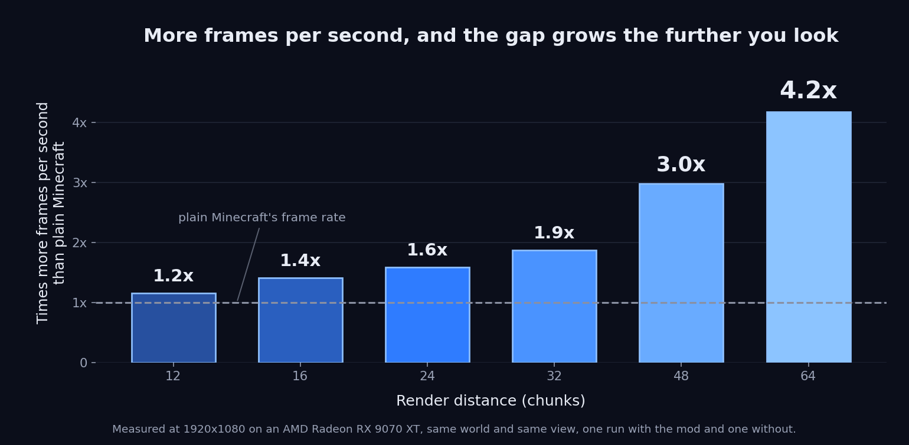

  

<h1 align="center">Meshelium</h1>

<b>See way further in Minecraft, and get more frames doing it.</b>

  

  
  
  

Frames per second at 1920x1080, same computer, same world, looking the same way. One run with Meshelium, one without.

**The further you look, the bigger Meshelium wins.** Here are the actual frame rates behind that graph, in frames per second, so higher is better:

| Render distance | Meshelium FPS | Plain Minecraft FPS | Difference |
|---|---|---|---|
| 12, Minecraft's default | 1,748 | 1,511 | 1.2x |
| 16 | 1,486 | 1,054 | 1.4x |
| 24 | 946 | 597 | 1.6x |
| 32, as far as Minecraft goes | **696** | 372 | **1.9x** |
| 48 | **513** | 172 | **3.0x** |
| 64 | **413** | 99 | **4.2x** |

Minecraft's own slider stops at 32. Meshelium unlocks 48 and 64, and we measured plain Minecraft out there too so the comparison stays fair.

## What you need

- **Minecraft 26.2** with the **Fabric** loader
- [**Fabric API**](https://modrinth.com/mod/fabric-api), the helper mod almost every mod wants. Put it in your mods folder too
- Windows or Linux. Sorry, no Mac
- A graphics card that supports mesh shaders, which means **AMD** RX 6000 or newer, **NVIDIA** GTX 16xx or newer, or **Intel** Arc. Newer laptop and handheld chips count too, including the Steam Deck
- If your card is older than that, Meshelium switches itself off, tells you why, and your game keeps working normally

Only you need this mod. Your friends do not, and neither does your server.

## Do this or nothing will happen

Minecraft starts up in the old drawing mode, called OpenGL. Meshelium only works in the new one, called Vulkan. Switching takes ten seconds, and you only do it once.

1. Open **Options**
2. Go to **Video Settings**
3. Find **Graphics API**
4. Choose **Prefer Vulkan**
5. **Close Minecraft and start it again.** It only changes while the game is loading

Skip this and it looks like the mod did nothing at all. If that happens, Meshelium puts a message on your screen with a button that does the whole thing for you.

## Playing online?

**Add [Bobby](https://modrinth.com/mod/bobby) to your own mods folder, next to Meshelium.**

A server only sends you the land close to you, so a huge render distance has nothing out there to draw. Bobby remembers the places the server already showed you and puts them back when you walk away. Bobby remembers the world, Meshelium draws it.

Nothing gets installed on the server. Bobby runs in your game, just like this mod, and the server never knows either one is there.

## Performance may vary

These numbers come from one computer with an AMD Radeon RX 9070 XT at 1920x1080, so yours will land somewhere else. At short render distances the difference is small, and the mod earns its place when you push the slider out.

## Thanks

### Nvidium, by MCRcortex

Meshelium exists because of [Nvidium](https://github.com/MCRcortex/nvidium). MCRcortex worked out how to hand Minecraft's terrain to the graphics card and draw it all at once, and proved you really could see for miles without the game falling over. That was the hard part, and it was their idea.

Nvidium only runs on NVIDIA cards, so Meshelium rebuilds the same idea in a way that works on AMD and Intel too. The design we learned it from is theirs, and a lot of this mod is us following a path they cut first. Go and give their project a star.

### And

- **Bobby** by **Johni0702**, the perfect partner for playing online
- The **Fabric** team, for the loader and Fabric API
- License: **LGPL-3.0**, the same license Nvidium uses

Want the deep version? It is in [TECHNICAL.md](docs/TECHNICAL.md) and [PERFORMANCE.md](docs/PERFORMANCE.md).
